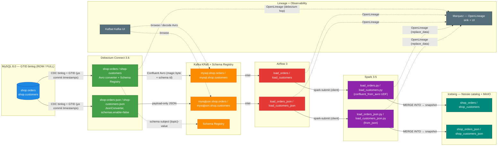

# Data Lineage POC — MySQL → Debezium → Kafka → Airflow → Spark → Iceberg

Runnable docker-compose POC for end-to-end **column-level data lineage** across a CDC +
orchestration pipeline. The stack is **executed and verified** end-to-end: lineage
metadata is collected via OpenLineage into **Marquez** (OpenLineage backend + UI,
http://localhost:3000, API :5000) — the central lineage store for every hop.

Two **parallel serialization paths** run side by side through the same pipeline:

- **Avro path (default)** — Debezium Avro converters + Schema Registry (`mysql.shop.orders` / `mysql.shop.customers`).
- **JSON path** — Debezium `JsonConverter` with payload-only JSON (`mysqljson.shop.orders` / `mysqljson.shop.customers`), readable without a registry.

## Pipeline (data lineage)



## Status

**EXECUTION PHASE COMPLETE — full pipeline verified end-to-end in Marquez** (orders +
customers, Avro AND JSON paths). DAGs run to SUCCESS; Iceberg tables are populated;
Marquez records the MySQL → Kafka → Airflow → Spark → Iceberg chain, with the `debezium →
kafka` edge correct for the Avro orders chain and microsecond-precision source timestamps
(GTID, DBZ-7183). See `STATE.md` for the full session history and remaining work.

## Services (docker-compose)

| Service | URL / endpoint | Credentials |
|---|---|---|
| Marquez UI (lineage graph) | http://localhost:3000 | — |
| Marquez API (OpenLineage sink) | http://localhost:5000 | — |
| Airflow UI | http://localhost:8080 | `admin` / `admin` |
| Kafbat Kafka UI (browse topics, decode Avro) | http://localhost:8090 | — |
| Kafka Connect (Debezium) | http://localhost:8083 | — |
| Schema Registry | http://localhost:8081 | — |
| Spark master / worker UI | http://localhost:8082 / :8084 | — |
| Nessie (Iceberg REST catalog) | http://localhost:19120 | — |
| MinIO console / S3 | http://localhost:9002 / :9000 | `pocadmin` / `minio-poc-secret` |
| MySQL | localhost:13306 (db `shop`) | root / `MYSQL_ROOT_PASSWORD` (`.env`) |

## Quickstart

```bash
# Full stack (MySQL, Debezium, Kafka, Airflow, Spark, Nessie, MinIO, Marquez)
docker compose up -d

# CDC-only stack (MySQL, Kafka, Connect, Marquez + Kafbat UI)
docker compose -f docker-compose.cdc.yml up -d

# Run a DAG (scheduler container)
docker exec airflow-scheduler airflow dags trigger load_orders        # Avro path
docker exec airflow-scheduler airflow dags trigger load_orders_json   # JSON path
```

- The `provision` one-shot gate registers the four Debezium connectors
  (`shop-orders`, `shop-customers`, `shop-orders-json`, `shop-customers-json`).
- View the whole pipeline as one lineage graph in Marquez → search `mysql.shop.orders`
  (Avro) or `mysqljson.shop.orders` (JSON) → **Lineage** tab.

## Serialization paths

| | Avro path | JSON path |
|---|---|---|
| Connectors | `shop-orders` / `shop-customers` | `shop-orders-json` / `shop-customers-json` |
| Converter | Confluent Avro + Schema Registry | `JsonConverter`, `schemas.enable=false`, `decimal.handling.mode=string` |
| Topics | `mysql.shop.orders` / `mysql.shop.customers` | `mysqljson.shop.orders` / `mysqljson.shop.customers` |
| Spark apps | `load_orders.py` / `load_customers.py` (`confluent_from_avro` UDF) | `load_orders_json.py` / `load_customers_json.py` (`from_json`) |
| Iceberg tables | `nessie.poc.shop_orders` / `shop_customers` | `nessie.poc.shop_orders_json` / `shop_customers_json` |
| DAGs | `load_orders` / `load_customers` | `load_orders_json` / `load_customers_json` |

## Structure

```
data-lineage-poc/
├── README.md
├── STATE.md                 # session resume point / full history
├── docker-compose.yml       # full stack (MySQL, Debezium, Kafka, Airflow, Spark, Nessie, MinIO, Marquez)
├── docker-compose.cdc.yml   # CDC-only stack (+ Kafbat Kafka UI)
├── Dockerfile.airflow       # Airflow image (spark-submit client, pyiceberg, openlineage)
├── Dockerfile.spark         # Spark image (Iceberg/Nessie/Kafka/OpenLineage jars)
├── Dockerfile.connect       # Debezium Connect image (OpenLineage core libs + client config)
├── spark-defaults.conf      # Nessie catalog, S3A mirror, OpenLineage listener (HTTP → Marquez)
├── dags/                    # load_orders{,json}, load_customers{,json} + config.py
├── spark-apps/              # load_orders{,json}.py, load_customers{,json}.py
├── provisioning/            # init-mysql.sql, cdc.cnf, register-connectors.sh, mc-init.sh, openlineage.yml
├── docs/diagrams/           # Mermaid sources
├── reports/                 # review output (markdown + self-contained HTML)
└── specs/                   # POC design documents (00–07)
```

Environment variables are provided via a local `.env` file (see the compose files for the
variable names); no env templates are committed.

## Specs

| Spec | Contents |
|---|---|
| `00-overview.md` | Goals, scope, non-goals, roles, timeline |
| `01-pipeline-architecture.md` | End-to-end flow and component boundaries |
| `02-lineage-model.md` | Canonical lineage metadata model (incl. JSON-path datasets) |
| `03-debezium-kafka-spec.md` | CDC connectors (Avro + JSON), topics, schema, lineage output |
| `04-airflow-spec.md` | DAGs, OpenLineage events, transform precision |
| `05-iceberg-spec.md` | Tables, catalog, snapshot lifecycle |
| `06-validation-metrics.md` | Success criteria, risks, open questions |
| `07-deployment-docker.md` | docker-compose topology, bring-up, validation |

## Known limitations

- **Debezium emitter-cache collision (customers attribution):** both Avro connectors share
  `topic.prefix=mysql`, so the `customers` connector's OpenLineage events land under the
  `debezium.shop-orders` job (STATE.md §6). The JSON connectors therefore run with the
  Debezium OpenLineage integration **disabled**; their lineage starts at the Kafka topic.
- **`source.ts_ns` is microsecond-derived** (`ts_us × 1000`): MySQL GTID commit timestamps
  are microsecond-resolution, so nanosecond-level DB event times do not exist.
- **Concurrent DAG runs** on the same Iceberg table can hit a transient
  `ValidationException: Found conflicting files` MERGE conflict (retry resolves it).

## Reports

The `data-architecture` review output lives in `reports/` (each report ships as markdown
plus a self-contained, human-readable HTML version):
- `reports/mysql-gtid-timestamp-precision.{md,html}` — GTID microsecond source timestamps (DBZ-7183)
- `reports/architecture-diagram.{md,html}` — ASCII architecture + lineage flow
- `reports/architecture-review.{md,html}` · `reports/cdc-openlineage-review.{md,html}` · `reports/airflow-spark-iceberg-review.{md,html}`